# Application Flow

This document describes the key application flows in ClipFlowAI, providing a detailed walkthrough of how users interact with the system and how data flows through the application.

## 1. User Authentication Flow

### 1.1 Registration Flow

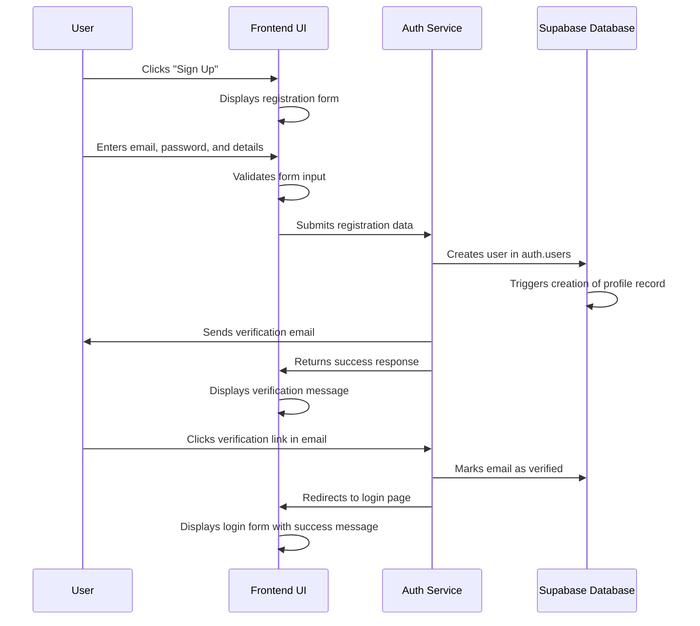
```mermaid
sequenceDiagram
    participant User
    participant UI as Frontend UI
    participant Auth as Auth Service
    participant DB as Supabase Database
    
    User->>UI: Clicks "Sign Up"
    UI->>UI: Displays registration form
    User->>UI: Enters email, password, and details
    UI->>UI: Validates form input
    UI->>Auth: Submits registration data
    Auth->>DB: Creates user in auth.users
    DB->>DB: Triggers creation of profile record
    Auth->>User: Sends verification email
    Auth->>UI: Returns success response
    UI->>UI: Displays verification message
    User->>Auth: Clicks verification link in email
    Auth->>DB: Marks email as verified
    Auth->>UI: Redirects to login page
    UI->>UI: Displays login form with success message
```

### 1.2 Login Flow

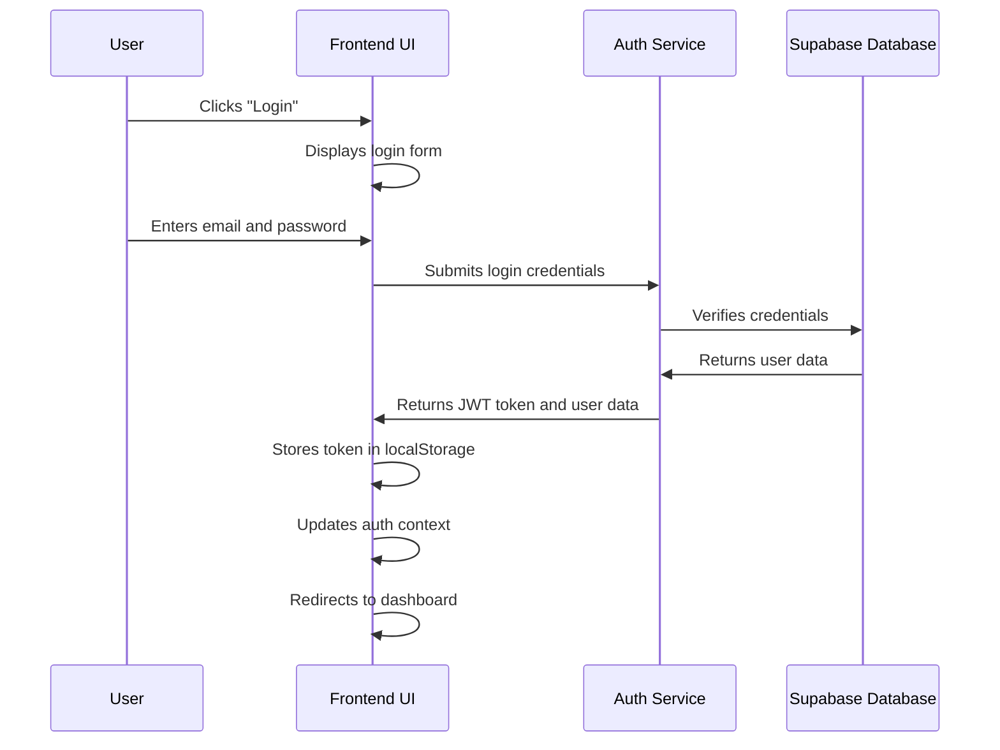
```mermaid
sequenceDiagram
    participant User
    participant UI as Frontend UI
    participant Auth as Auth Service
    participant DB as Supabase Database
    
    User->>UI: Clicks "Login"
    UI->>UI: Displays login form
    User->>UI: Enters email and password
    UI->>Auth: Submits login credentials
    Auth->>DB: Verifies credentials
    DB->>Auth: Returns user data
    Auth->>UI: Returns JWT token and user data
    UI->>UI: Stores token in localStorage
    UI->>UI: Updates auth context
    UI->>UI: Redirects to dashboard
```

### 1.3 Password Reset Flow

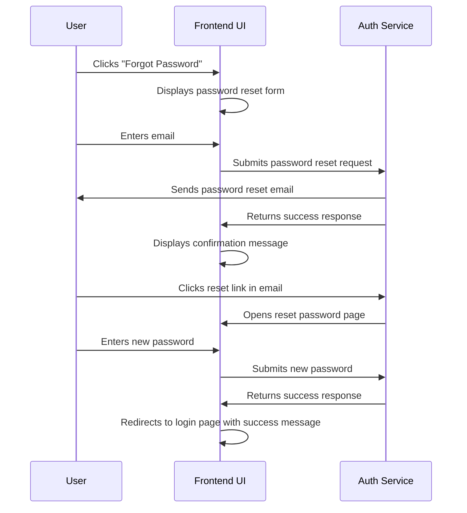
```mermaid
sequenceDiagram
    participant User
    participant UI as Frontend UI
    participant Auth as Auth Service
    
    User->>UI: Clicks "Forgot Password"
    UI->>UI: Displays password reset form
    User->>UI: Enters email
    UI->>Auth: Submits password reset request
    Auth->>User: Sends password reset email
    Auth->>UI: Returns success response
    UI->>UI: Displays confirmation message
    User->>Auth: Clicks reset link in email
    Auth->>UI: Opens reset password page
    User->>UI: Enters new password
    UI->>Auth: Submits new password
    Auth->>UI: Returns success response
    UI->>UI: Redirects to login page with success message
```

## 2. Video Creation Flow

### 2.1 Basic Video Creation Flow

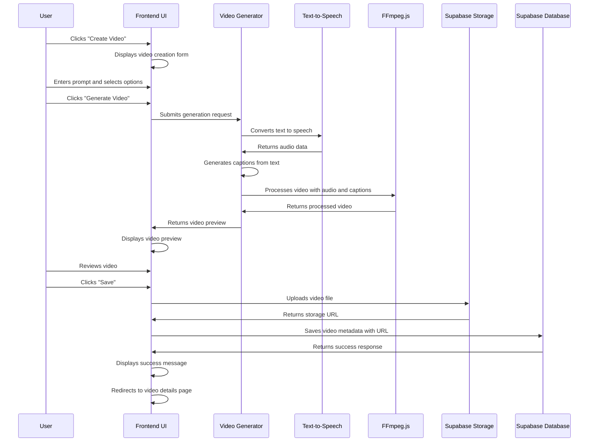
```mermaid
sequenceDiagram
    participant User
    participant UI as Frontend UI
    participant VG as Video Generator
    participant TTS as Text-to-Speech
    participant FFmpeg as FFmpeg.js
    participant Storage as Supabase Storage
    participant DB as Supabase Database
    
    User->>UI: Clicks "Create Video"
    UI->>UI: Displays video creation form
    User->>UI: Enters prompt and selects options
    User->>UI: Clicks "Generate Video"
    UI->>VG: Submits generation request
    VG->>TTS: Converts text to speech
    TTS->>VG: Returns audio data
    VG->>VG: Generates captions from text
    VG->>FFmpeg: Processes video with audio and captions
    FFmpeg->>VG: Returns processed video
    VG->>UI: Returns video preview
    UI->>UI: Displays video preview
    User->>UI: Reviews video
    User->>UI: Clicks "Save"
    UI->>Storage: Uploads video file
    Storage->>UI: Returns storage URL
    UI->>DB: Saves video metadata with URL
    DB->>UI: Returns success response
    UI->>UI: Displays success message
    UI->>UI: Redirects to video details page
```

### 2.2 Video Creation with Background Image Flow

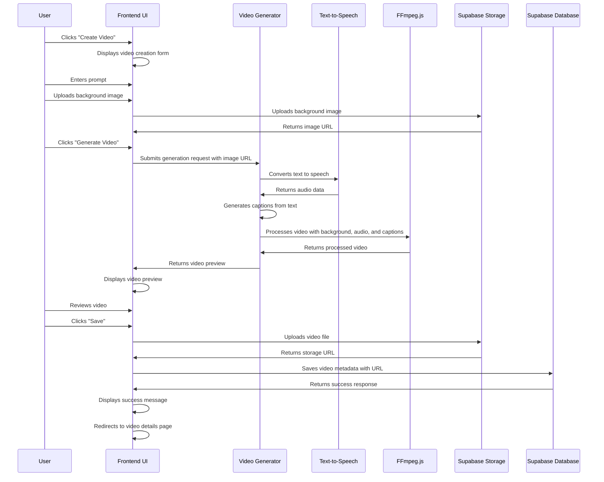
```mermaid
sequenceDiagram
    participant User
    participant UI as Frontend UI
    participant VG as Video Generator
    participant TTS as Text-to-Speech
    participant FFmpeg as FFmpeg.js
    participant Storage as Supabase Storage
    participant DB as Supabase Database
    
    User->>UI: Clicks "Create Video"
    UI->>UI: Displays video creation form
    User->>UI: Enters prompt
    User->>UI: Uploads background image
    UI->>Storage: Uploads background image
    Storage->>UI: Returns image URL
    User->>UI: Clicks "Generate Video"
    UI->>VG: Submits generation request with image URL
    VG->>TTS: Converts text to speech
    TTS->>VG: Returns audio data
    VG->>VG: Generates captions from text
    VG->>FFmpeg: Processes video with background, audio, and captions
    FFmpeg->>VG: Returns processed video
    VG->>UI: Returns video preview
    UI->>UI: Displays video preview
    User->>UI: Reviews video
    User->>UI: Clicks "Save"
    UI->>Storage: Uploads video file
    Storage->>UI: Returns storage URL
    UI->>DB: Saves video metadata with URL
    DB->>UI: Returns success response
    UI->>UI: Displays success message
    UI->>UI: Redirects to video details page
```

## 3. Video Management Flow

### 3.1 Video Dashboard Flow

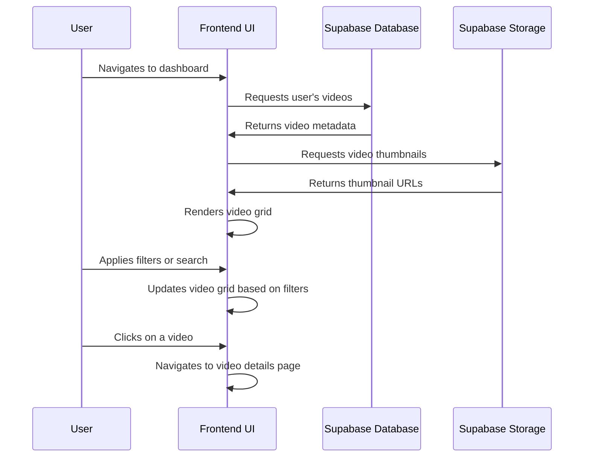
```mermaid
sequenceDiagram
    participant User
    participant UI as Frontend UI
    participant DB as Supabase Database
    participant Storage as Supabase Storage
    
    User->>UI: Navigates to dashboard
    UI->>DB: Requests user's videos
    DB->>UI: Returns video metadata
    UI->>Storage: Requests video thumbnails
    Storage->>UI: Returns thumbnail URLs
    UI->>UI: Renders video grid
    User->>UI: Applies filters or search
    UI->>UI: Updates video grid based on filters
    User->>UI: Clicks on a video
    UI->>UI: Navigates to video details page
```

### 3.2 Video Details Flow

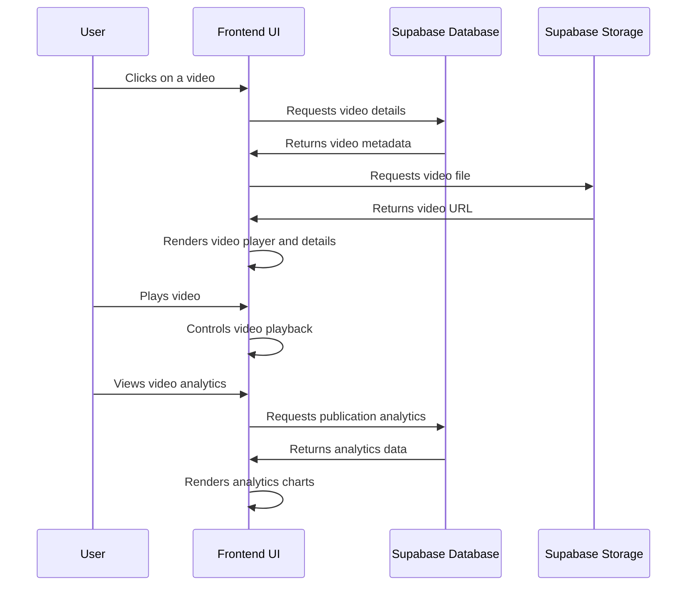
```mermaid
sequenceDiagram
    participant User
    participant UI as Frontend UI
    participant DB as Supabase Database
    participant Storage as Supabase Storage
    
    User->>UI: Clicks on a video
    UI->>DB: Requests video details
    DB->>UI: Returns video metadata
    UI->>Storage: Requests video file
    Storage->>UI: Returns video URL
    UI->>UI: Renders video player and details
    User->>UI: Plays video
    UI->>UI: Controls video playback
    User->>UI: Views video analytics
    UI->>DB: Requests publication analytics
    DB->>UI: Returns analytics data
    UI->>UI: Renders analytics charts
```

### 3.3 Video Editing Flow

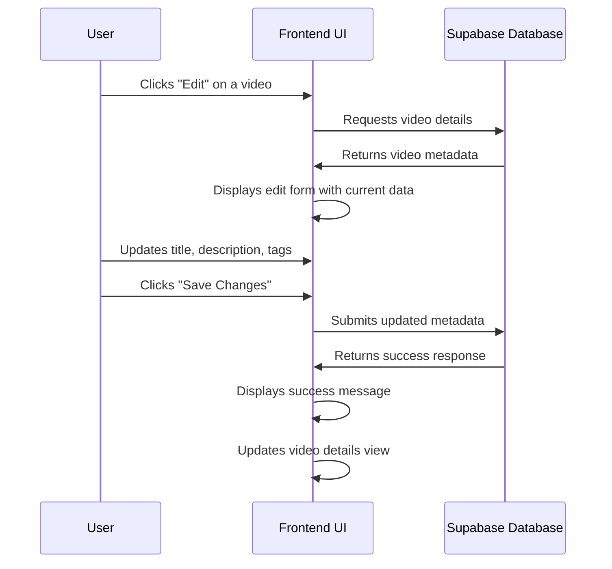
```mermaid
sequenceDiagram
    participant User
    participant UI as Frontend UI
    participant DB as Supabase Database
    
    User->>UI: Clicks "Edit" on a video
    UI->>DB: Requests video details
    DB->>UI: Returns video metadata
    UI->>UI: Displays edit form with current data
    User->>UI: Updates title, description, tags
    User->>UI: Clicks "Save Changes"
    UI->>DB: Submits updated metadata
    DB->>UI: Returns success response
    UI->>UI: Displays success message
    UI->>UI: Updates video details view
```

### 3.4 Video Deletion Flow

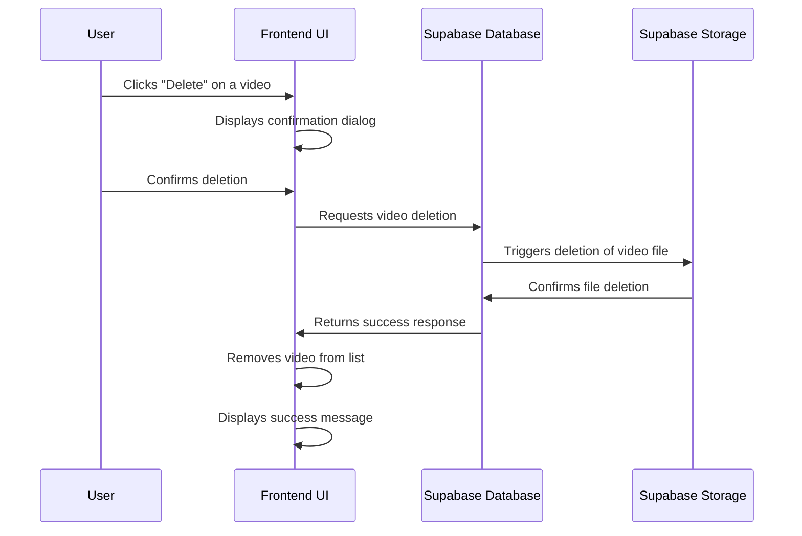
```mermaid
sequenceDiagram
    participant User
    participant UI as Frontend UI
    participant DB as Supabase Database
    participant Storage as Supabase Storage
    
    User->>UI: Clicks "Delete" on a video
    UI->>UI: Displays confirmation dialog
    User->>UI: Confirms deletion
    UI->>DB: Requests video deletion
    DB->>Storage: Triggers deletion of video file
    Storage->>DB: Confirms file deletion
    DB->>UI: Returns success response
    UI->>UI: Removes video from list
    UI->>UI: Displays success message
```

## 4. Social Media Integration Flow

### 4.1 Platform Connection Flow

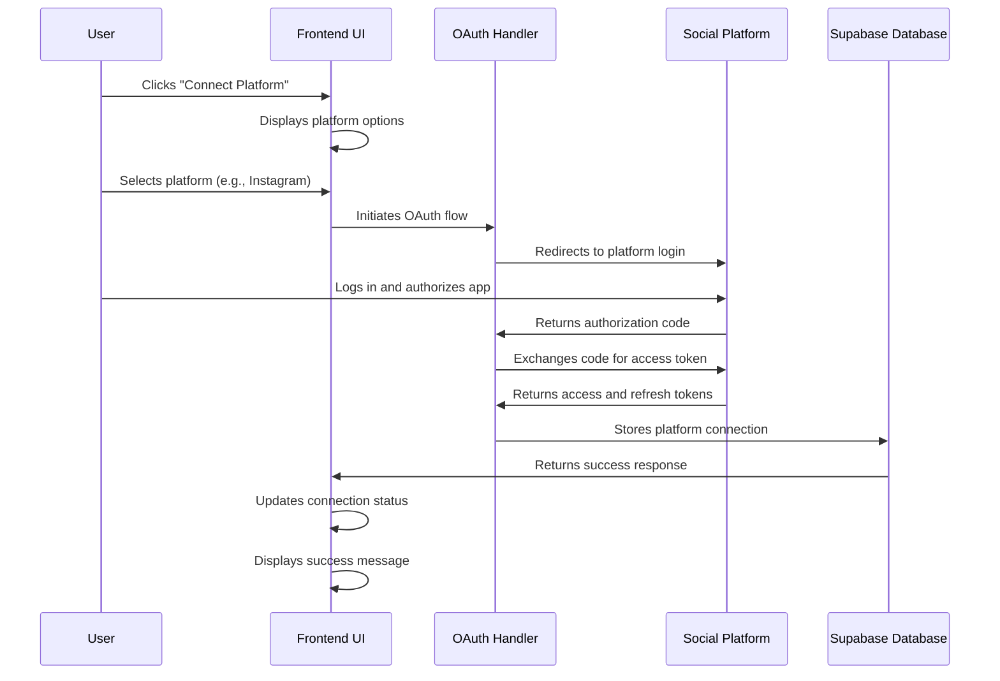
```mermaid
sequenceDiagram
    participant User
    participant UI as Frontend UI
    participant Auth as OAuth Handler
    participant Platform as Social Platform
    participant DB as Supabase Database
    
    User->>UI: Clicks "Connect Platform"
    UI->>UI: Displays platform options
    User->>UI: Selects platform (e.g., Instagram)
    UI->>Auth: Initiates OAuth flow
    Auth->>Platform: Redirects to platform login
    User->>Platform: Logs in and authorizes app
    Platform->>Auth: Returns authorization code
    Auth->>Platform: Exchanges code for access token
    Platform->>Auth: Returns access and refresh tokens
    Auth->>DB: Stores platform connection
    DB->>UI: Returns success response
    UI->>UI: Updates connection status
    UI->>UI: Displays success message
```

### 4.2 Platform Disconnection Flow

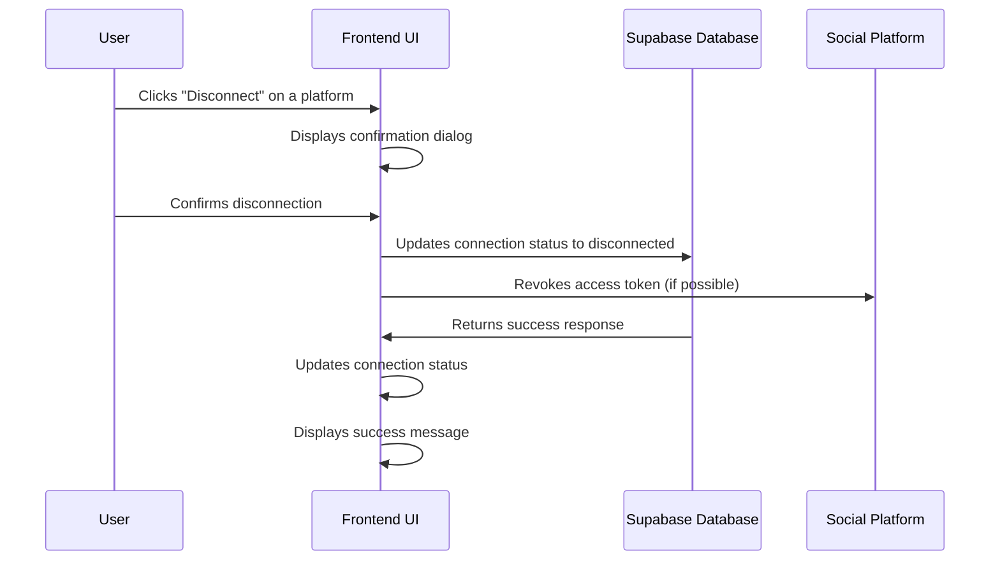
```mermaid
sequenceDiagram
    participant User
    participant UI as Frontend UI
    participant DB as Supabase Database
    participant Platform as Social Platform
    
    User->>UI: Clicks "Disconnect" on a platform
    UI->>UI: Displays confirmation dialog
    User->>UI: Confirms disconnection
    UI->>DB: Updates connection status to disconnected
    UI->>Platform: Revokes access token (if possible)
    DB->>UI: Returns success response
    UI->>UI: Updates connection status
    UI->>UI: Displays success message
```

## 5. Video Publishing Flow

### 5.1 Direct Publishing Flow

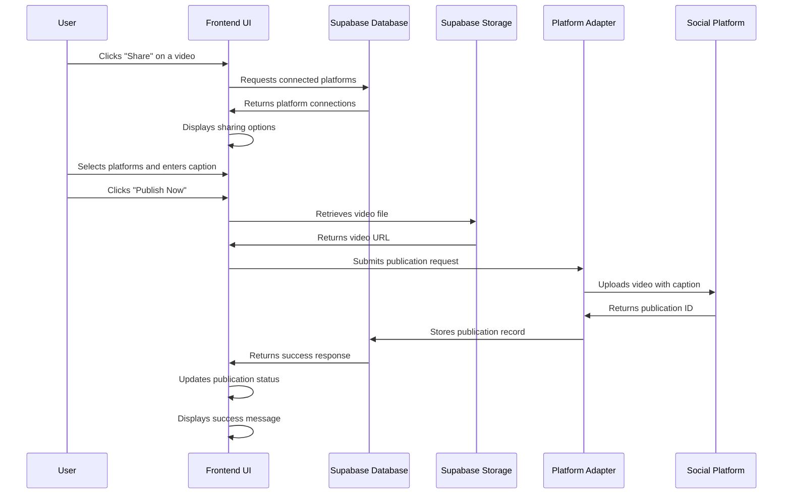
```mermaid
sequenceDiagram
    participant User
    participant UI as Frontend UI
    participant DB as Supabase Database
    participant Storage as Supabase Storage
    participant Adapter as Platform Adapter
    participant Platform as Social Platform
    
    User->>UI: Clicks "Share" on a video
    UI->>DB: Requests connected platforms
    DB->>UI: Returns platform connections
    UI->>UI: Displays sharing options
    User->>UI: Selects platforms and enters caption
    User->>UI: Clicks "Publish Now"
    UI->>Storage: Retrieves video file
    Storage->>UI: Returns video URL
    UI->>Adapter: Submits publication request
    Adapter->>Platform: Uploads video with caption
    Platform->>Adapter: Returns publication ID
    Adapter->>DB: Stores publication record
    DB->>UI: Returns success response
    UI->>UI: Updates publication status
    UI->>UI: Displays success message
```

### 5.2 Scheduled Publishing Flow

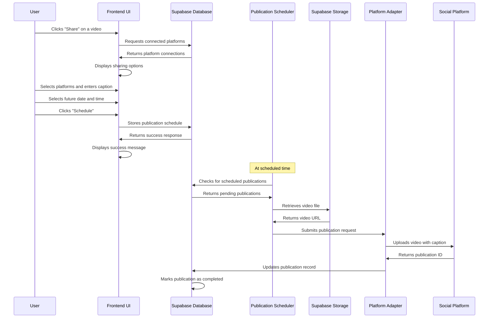
```mermaid
sequenceDiagram
    participant User
    participant UI as Frontend UI
    participant DB as Supabase Database
    participant Scheduler as Publication Scheduler
    participant Storage as Supabase Storage
    participant Adapter as Platform Adapter
    participant Platform as Social Platform
    
    User->>UI: Clicks "Share" on a video
    UI->>DB: Requests connected platforms
    DB->>UI: Returns platform connections
    UI->>UI: Displays sharing options
    User->>UI: Selects platforms and enters caption
    User->>UI: Selects future date and time
    User->>UI: Clicks "Schedule"
    UI->>DB: Stores publication schedule
    DB->>UI: Returns success response
    UI->>UI: Displays success message
    
    Note over Scheduler: At scheduled time
    Scheduler->>DB: Checks for scheduled publications
    DB->>Scheduler: Returns pending publications
    Scheduler->>Storage: Retrieves video file
    Storage->>Scheduler: Returns video URL
    Scheduler->>Adapter: Submits publication request
    Adapter->>Platform: Uploads video with caption
    Platform->>Adapter: Returns publication ID
    Adapter->>DB: Updates publication record
    DB->>DB: Marks publication as completed
```

## 6. Analytics Flow

### 6.1 Video Analytics Flow

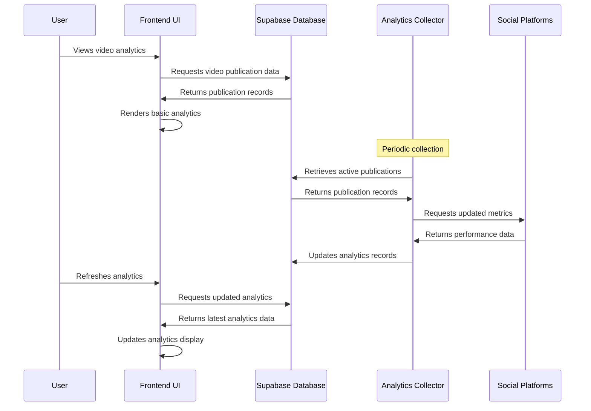
```mermaid
sequenceDiagram
    participant User
    participant UI as Frontend UI
    participant DB as Supabase Database
    participant Collector as Analytics Collector
    participant Platform as Social Platforms
    
    User->>UI: Views video analytics
    UI->>DB: Requests video publication data
    DB->>UI: Returns publication records
    UI->>UI: Renders basic analytics
    
    Note over Collector: Periodic collection
    Collector->>DB: Retrieves active publications
    DB->>Collector: Returns publication records
    Collector->>Platform: Requests updated metrics
    Platform->>Collector: Returns performance data
    Collector->>DB: Updates analytics records
    
    User->>UI: Refreshes analytics
    UI->>DB: Requests updated analytics
    DB->>UI: Returns latest analytics data
    UI->>UI: Updates analytics display
```

### 6.2 Dashboard Analytics Flow

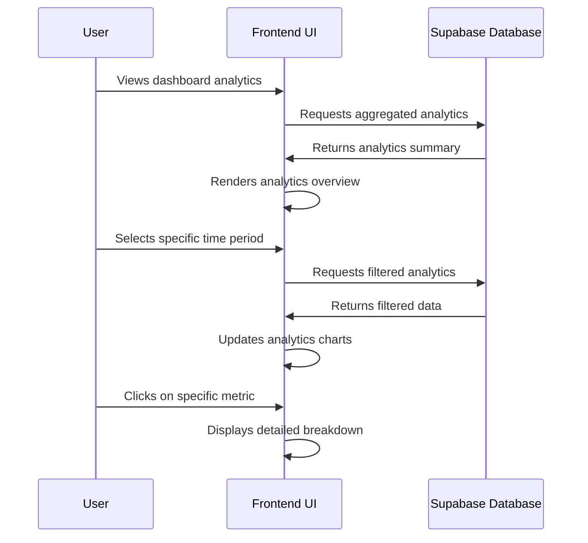
```mermaid
sequenceDiagram
    participant User
    participant UI as Frontend UI
    participant DB as Supabase Database
    
    User->>UI: Views dashboard analytics
    UI->>DB: Requests aggregated analytics
    DB->>UI: Returns analytics summary
    UI->>UI: Renders analytics overview
    User->>UI: Selects specific time period
    UI->>DB: Requests filtered analytics
    DB->>UI: Returns filtered data
    UI->>UI: Updates analytics charts
    User->>UI: Clicks on specific metric
    UI->>UI: Displays detailed breakdown
```

## 7. User Settings Flow

### 7.1 Profile Update Flow

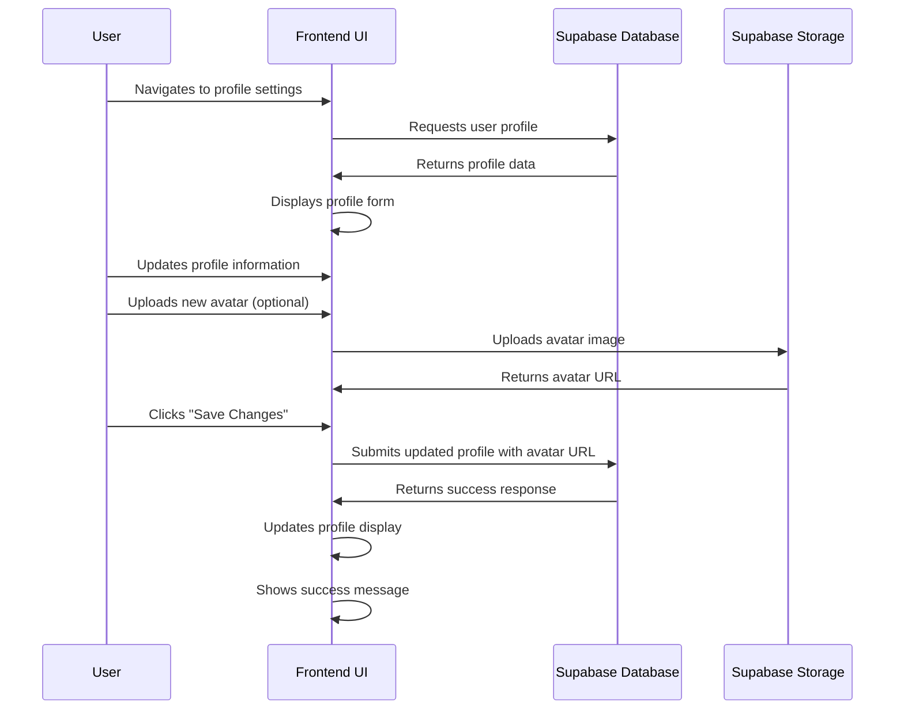
```mermaid
sequenceDiagram
    participant User
    participant UI as Frontend UI
    participant DB as Supabase Database
    participant Storage as Supabase Storage
    
    User->>UI: Navigates to profile settings
    UI->>DB: Requests user profile
    DB->>UI: Returns profile data
    UI->>UI: Displays profile form
    User->>UI: Updates profile information
    User->>UI: Uploads new avatar (optional)
    UI->>Storage: Uploads avatar image
    Storage->>UI: Returns avatar URL
    User->>UI: Clicks "Save Changes"
    UI->>DB: Submits updated profile with avatar URL
    DB->>UI: Returns success response
    UI->>UI: Updates profile display
    UI->>UI: Shows success message
```

### 7.2 Account Settings Flow

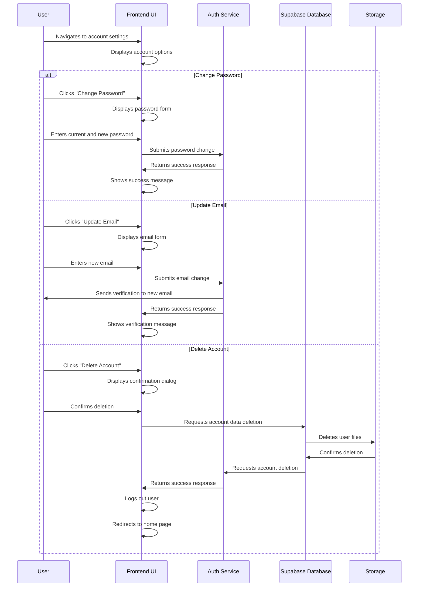
```mermaid
sequenceDiagram
    participant User
    participant UI as Frontend UI
    participant Auth as Auth Service
    participant DB as Supabase Database
    
    User->>UI: Navigates to account settings
    UI->>UI: Displays account options
    
    alt Change Password
        User->>UI: Clicks "Change Password"
        UI->>UI: Displays password form
        User->>UI: Enters current and new password
        UI->>Auth: Submits password change
        Auth->>UI: Returns success response
        UI->>UI: Shows success message
    else Update Email
        User->>UI: Clicks "Update Email"
        UI->>UI: Displays email form
        User->>UI: Enters new email
        UI->>Auth: Submits email change
        Auth->>User: Sends verification to new email
        Auth->>UI: Returns success response
        UI->>UI: Shows verification message
    else Delete Account
        User->>UI: Clicks "Delete Account"
        UI->>UI: Displays confirmation dialog
        User->>UI: Confirms deletion
        UI->>DB: Requests account data deletion
        DB->>Storage: Deletes user files
        Storage->>DB: Confirms deletion
        DB->>Auth: Requests account deletion
        Auth->>UI: Returns success response
        UI->>UI: Logs out user
        UI->>UI: Redirects to home page
    end
```

## 8. Error Handling Flows

### 8.1 Authentication Error Flow

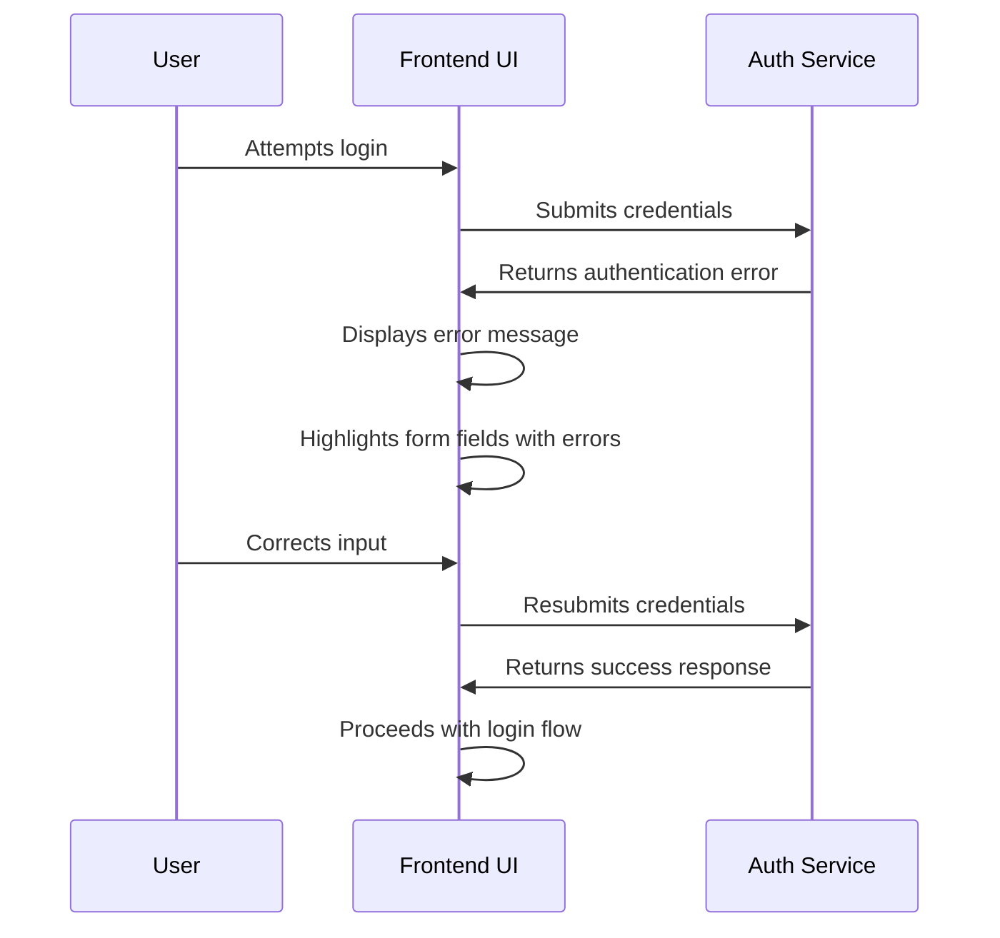
```mermaid
sequenceDiagram
    participant User
    participant UI as Frontend UI
    participant Auth as Auth Service
    
    User->>UI: Attempts login
    UI->>Auth: Submits credentials
    Auth->>UI: Returns authentication error
    UI->>UI: Displays error message
    UI->>UI: Highlights form fields with errors
    User->>UI: Corrects input
    UI->>Auth: Resubmits credentials
    Auth->>UI: Returns success response
    UI->>UI: Proceeds with login flow
```

### 8.2 Video Generation Error Flow

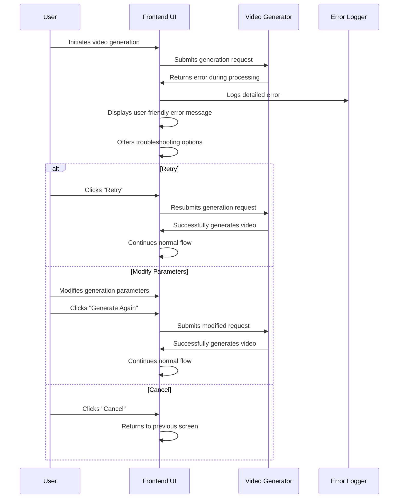
```mermaid
sequenceDiagram
    participant User
    participant UI as Frontend UI
    participant VG as Video Generator
    participant Logger as Error Logger
    
    User->>UI: Initiates video generation
    UI->>VG: Submits generation request
    VG->>UI: Returns error during processing
    UI->>Logger: Logs detailed error
    UI->>UI: Displays user-friendly error message
    UI->>UI: Offers troubleshooting options
    
    alt Retry
        User->>UI: Clicks "Retry"
        UI->>VG: Resubmits generation request
        VG->>UI: Successfully generates video
        UI->>UI: Continues normal flow
    else Modify Parameters
        User->>UI: Modifies generation parameters
        User->>UI: Clicks "Generate Again"
        UI->>VG: Submits modified request
        VG->>UI: Successfully generates video
        UI->>UI: Continues normal flow
    else Cancel
        User->>UI: Clicks "Cancel"
        UI->>UI: Returns to previous screen
    end
```

### 8.3 API Error Flow

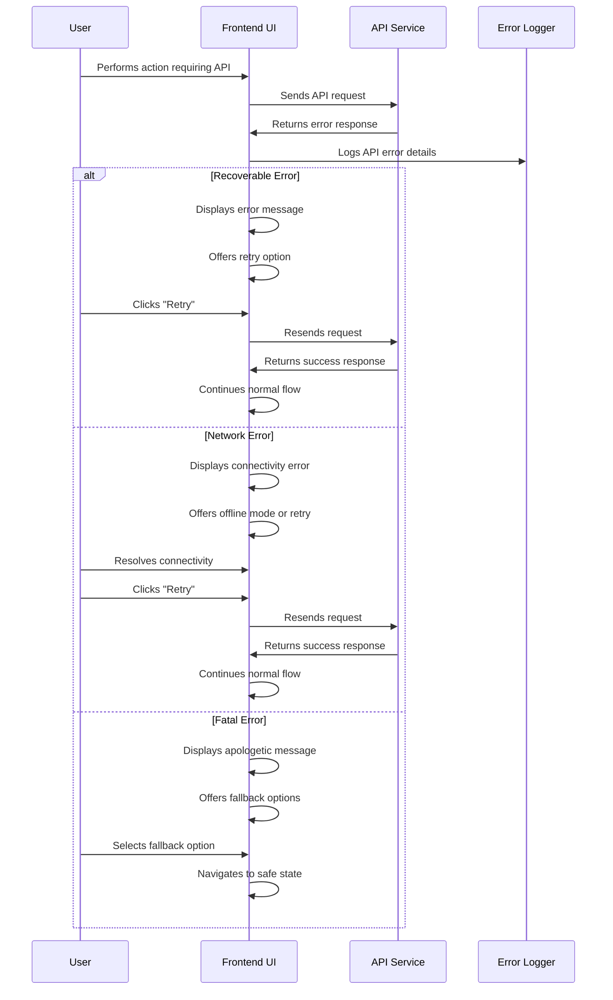
```mermaid
sequenceDiagram
    participant User
    participant UI as Frontend UI
    participant API as API Service
    participant Logger as Error Logger
    
    User->>UI: Performs action requiring API
    UI->>API: Sends API request
    API->>UI: Returns error response
    UI->>Logger: Logs API error details
    
    alt Recoverable Error
        UI->>UI: Displays error message
        UI->>UI: Offers retry option
        User->>UI: Clicks "Retry"
        UI->>API: Resends request
        API->>UI: Returns success response
        UI->>UI: Continues normal flow
    else Network Error
        UI->>UI: Displays connectivity error
        UI->>UI: Offers offline mode or retry
        User->>UI: Resolves connectivity
        User->>UI: Clicks "Retry"
        UI->>API: Resends request
        API->>UI: Returns success response
        UI->>UI: Continues normal flow
    else Fatal Error
        UI->>UI: Displays apologetic message
        UI->>UI: Offers fallback options
        User->>UI: Selects fallback option
        UI->>UI: Navigates to safe state
    end
```

## 9. Data Flow Diagrams

### 9.1 Overall Application Data Flow

```mermaid
flowchart TD
    User[User] <--> UI[Frontend UI]
    UI <--> Auth[Authentication]
    UI <--> VG[Video Generator]
    UI <--> SM[Social Media Integration]
    UI <--> Analytics[Analytics]
    
    Auth <--> DB[(Supabase Database)]
    VG <--> FFmpeg[FFmpeg.js]
    VG <--> TTS[Web Speech API]
    VG <--> Storage[(Supabase Storage)]
    SM <--> Platforms[Social Platforms]
    SM <--> DB
    Analytics <--> DB
    Analytics <--> Platforms
    
    DB <--> Storage
```

### 9.2 Video Generation Data Flow

```mermaid
flowchart TD
    Prompt[Text Prompt] --> Parser[Prompt Parser]
    Parser --> Script[Script Generator]
    Script --> TTS[Text-to-Speech]
    Script --> Captions[Caption Generator]
    
    BgImage[Background Image] --> Compositor[Video Compositor]
    TTS --> AudioProcessor[Audio Processor]
    AudioProcessor --> Compositor
    Captions --> Compositor
    
    Compositor --> FFmpeg[FFmpeg Processor]
    FFmpeg --> FinalVideo[Final Video]
    FinalVideo --> Storage[(Supabase Storage)]
    FinalVideo --> Preview[Video Preview]
    
    Storage --> DB[(Database Record)]
```

### 9.3 Authentication Data Flow

```mermaid
flowchart TD
    Credentials[User Credentials] --> Validator[Input Validator]
    Validator --> AuthService[Supabase Auth]
    AuthService --> JWT[JWT Token]
    
    JWT --> LocalStorage[Browser Storage]
    JWT --> AuthContext[Auth Context]
    
    AuthContext --> ProtectedRoutes[Protected Routes]
    AuthContext --> UserProfile[User Profile]
    
    AuthService --> UserRecord[User Record]
    UserRecord --> ProfileRecord[Profile Record]
```

## 10. State Transitions

### 10.1 Video State Transitions

```mermaid
stateDiagram-v2
    [*] --> Draft: Create New
    Draft --> Processing: Generate
    Processing --> Preview: Generation Complete
    Processing --> Error: Generation Failed
    Error --> Processing: Retry
    Preview --> Draft: Edit
    Preview --> Saved: Save
    Saved --> Published: Publish
    Published --> [*]: Delete
    Saved --> [*]: Delete
    Draft --> [*]: Cancel
```

### 10.2 Publication State Transitions

```mermaid
stateDiagram-v2
    [*] --> Pending: Submit
    Pending --> Processing: Start Upload
    Processing --> Published: Success
    Processing --> Failed: Error
    Failed --> Processing: Retry
    Published --> [*]: Delete
    Failed --> [*]: Cancel
```

### 10.3 User Session State Transitions

```mermaid
stateDiagram-v2
    [*] --> Anonymous: Initial Load
    Anonymous --> Authenticating: Login Attempt
    Authenticating --> Authenticated: Success
    Authenticating --> Anonymous: Failure
    Authenticated --> Anonymous: Logout
    Authenticated --> TokenRefresh: Token Expiring
    TokenRefresh --> Authenticated: Success
    TokenRefresh --> Anonymous: Failure
```

## Conclusion

This application flow document provides a comprehensive overview of how users interact with ClipFlowAI and how data flows through the system. By understanding these flows, developers can better implement the required functionality and ensure a smooth user experience.

The key aspects of the application flow include:

1. **User Authentication**: Secure login, registration, and account management
2. **Video Creation**: Client-side video generation with text-to-speech and captions
3. **Video Management**: Organization, editing, and deletion of videos
4. **Social Media Integration**: Connection to and management of social platforms
5. **Video Publishing**: Direct and scheduled publishing to multiple platforms
6. **Analytics**: Collection and visualization of performance metrics
7. **Error Handling**: Graceful recovery from various error conditions

These flows are designed to work within the constraints of a $0 budget approach, leveraging client-side processing and free tier services to provide a powerful video creation and publishing platform.
