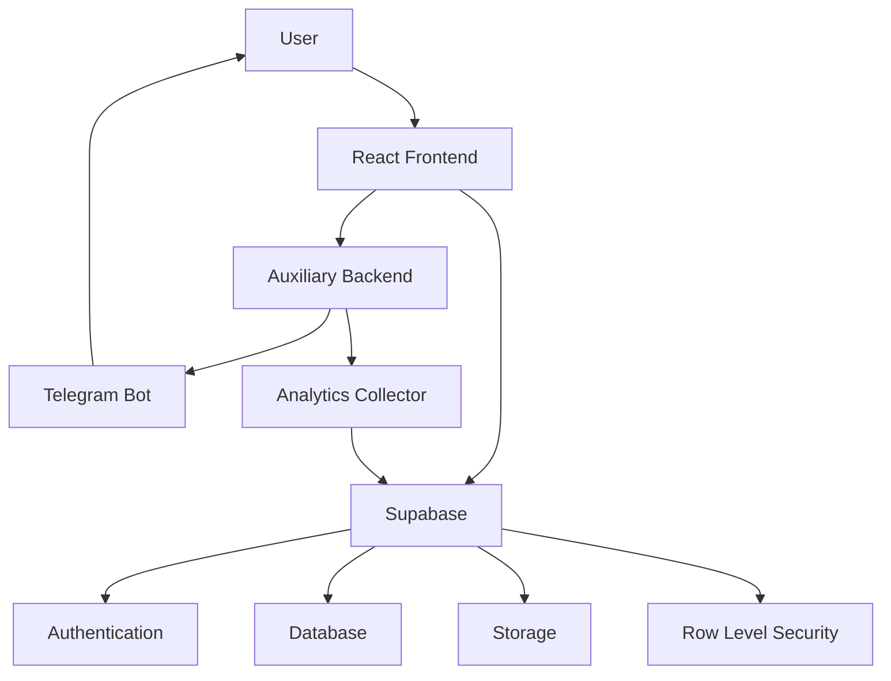
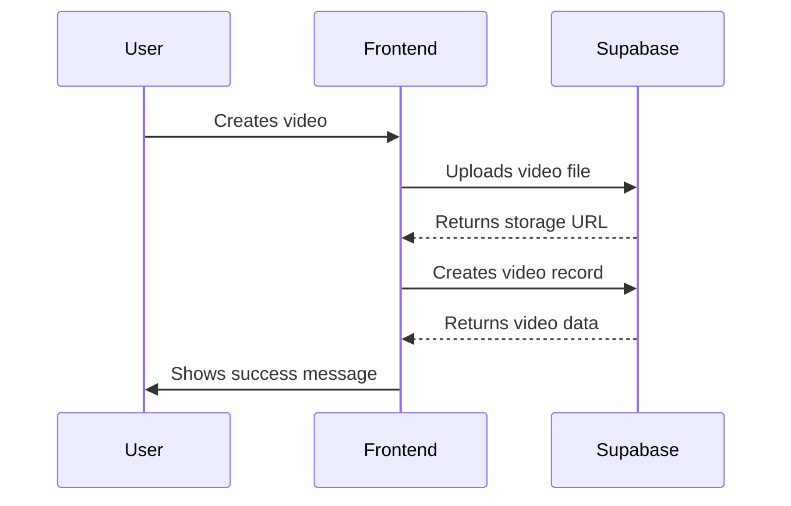
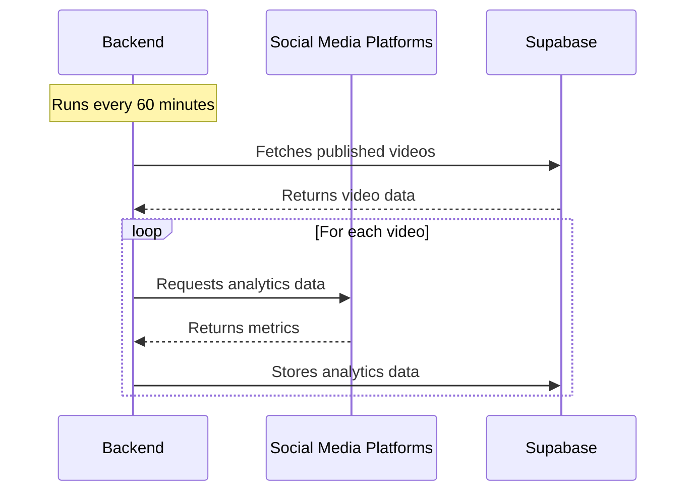
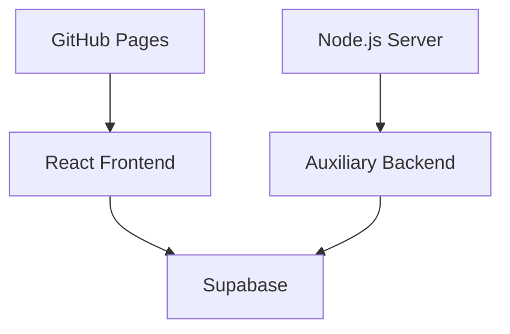

# Architecture Overview

## System Architecture

ClipFlowAI follows a frontend-centric architecture with Supabase as the backend-as-a-service (BaaS) provider. This approach allows for rapid development and deployment while maintaining security and scalability.

## Key Components

### Frontend (React)

The frontend is built with React and handles most of the application logic, including:

- User interface and experience
- Direct communication with Supabase for data operations
- Video creation and management
- Analytics visualization

### Supabase

Supabase provides several core services:

- **Authentication**: User signup, login, and profile management
- **Database**: PostgreSQL database for storing video metadata, platform information, and analytics
- **Storage**: File storage for videos and thumbnails
- **Row Level Security (RLS)**: Fine-grained access control at the row level

### Auxiliary Backend (Node.js)

A lightweight Node.js backend handles auxiliary services that cannot be managed directly from the frontend:

- **Telegram Bot**: Provides an alternative interface for creating and managing videos
- **Analytics Collector**: Periodically collects analytics data from social media platforms

## Data Flow

### Video Creation Flow

### Analytics Collection Flow

## Security Model

Security is primarily handled through Supabase's Row Level Security (RLS) policies:

- Users can only access their own data
- Authentication is managed through JWT tokens
- API keys are stored securely in environment variables
- The frontend never exposes sensitive credentials

## Deployment Architecture

The application is deployed using GitHub Pages for the frontend and a lightweight server for the auxiliary backend:

## Future Architectural Considerations

As the application grows, several architectural enhancements are planned:

1. **Serverless Functions**: Move auxiliary services to Supabase Edge Functions
2. **Real-time Updates**: Implement Supabase's real-time subscriptions for live analytics
3. **Caching Layer**: Add Redis caching for frequently accessed data
4. **Microservices**: Split the backend into specialized microservices for video processing, analytics, and notifications
